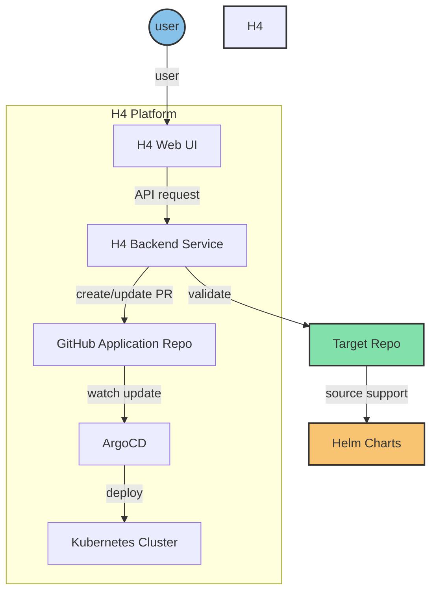

# H4 Platform

H4 Platform is a modern GitOps-based platform that simplifies multi-cluster Kubernetes management and application deployment. It abstracts away the complexity of Kubernetes CRDs and infrastructure configurations, allowing users to focus on their applications rather than the underlying technical details.

## Overview

H4 Platform uses Git repositories as the source of truth for declarative infrastructure and application definitions. Built on top of ArgoCD, it provides an enhanced user experience for managing multiple Kubernetes clusters across different environments. The platform automatically handles the generation and management of complex configurations, significantly reducing the cognitive load on users.

## Core Features

- **Zero-Configuration Deployment**
  - Automatic generation of Kubernetes CRDs and resources
  - Smart defaults for common deployment scenarios
  - No deep Kubernetes expertise required

- **GitOps-Driven Architecture**
  - Uses Git repositories as the single source of truth
  - Leverages ArgoCD for automated deployment and synchronization
  - Automated PR creation and management

- **Multi-Cluster Management**
  - Centralized control plane for multiple Kubernetes clusters
  - Environment segregation (Dev, Staging, Production)
  - Cross-cluster resource management without manual intervention

- **Enhanced Security Integration**
  - Automated Vault configuration and secret management
  - External Secrets Operator integration without manual setup

- **Application Template Library**
  - Ready-to-use templates for common applications
  - One-click deployment without YAML editing
  - Customizable template repository with best practices built-in

- **User Experience Optimization**
  - Simple web interface hiding infrastructure complexity
  - Automated configuration generation and validation
  - Real-time deployment status and monitoring
  - No need to understand underlying CRDs or Kubernetes internals

## How It Simplifies Your Work

Traditional Kubernetes deployment requires:
- Deep understanding of CRDs
- Manual YAML configuration
- Complex secret management setup
- ArgoCD configuration expertise

With H4 Platform:
- ✅ Click-to-deploy applications
- ✅ Automatic configuration generation
- ✅ Built-in best practices
- ✅ Simplified multi-cluster management
- ✅ Zero-touch secret management

## Architecture

H4 Platform Architecture Diagram:




## Components

1. **H4 Web UI**: User-friendly interface for platform management
2. **H4 Backend Service**: Core component providing RESTful APIs
3. **GitHub Application Repo**: Central repository for deployment configurations
4. **ArgoCD**: Manages GitOps-style deployments
5. **Kubernetes Cluster**: Underlying infrastructure for running applications

## Command-Line Tools

H4 Platform provides two main command-line tools:

1. **supervisor CLI** (`supervisor`):
   - Purpose: Initialize and manage application deployments
   - Key functions: Platform initialization, project management, status checks
   - Location: `cmd/supervisor/supervisor.go`

2. **Server CLI** (`server`):
   - Purpose: Run the API server for the H4 Platform
   - Key functions: Start API server, display version information
   - Location: `cmd/service/service.go`

## Getting Started

To build the command-line tools, use the following make commands:

## build

```shell
$ make build-service # Builds the server CLI
$ make build-supervisor # Builds the supervisor CLI
$ make build # Builds both CLIs
```