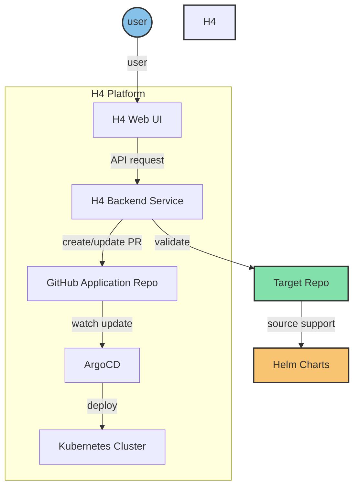

# H4 Platform Service

H4 Platform is a Kubernetes-based computing platform supporting `multi-tenancy`, `multi-cloud`, and `big data component integration`.

## Key Features

- Kubernetes-based, leveraging cloud-native technologies
- GitOps-style deployments with ArgoCD
- Custom H4 components for business-specific needs (e.g., approval, billing)
- User-friendly web UI for easy management
- RESTful API backend for core functionalities

## Architecture

H4 Platform Architecture Diagram:




## Components

1. **H4 Web UI**: User-friendly interface for platform management
2. **H4 Backend Service**: Core component providing RESTful APIs
3. **GitHub Application Repo**: Central repository for deployment configurations
4. **ArgoCD**: Manages GitOps-style deployments
5. **Kubernetes Cluster**: Underlying infrastructure for running applications

## Command-Line Tools

H4 Platform provides two main command-line tools:

1. **supervisor CLI** (`supervisor`):
   - Purpose: Initialize and manage application deployments
   - Key functions: Platform initialization, project management, status checks
   - Location: `cmd/supervisor/supervisor.go`

2. **Server CLI** (`server`):
   - Purpose: Run the API server for the H4 Platform
   - Key functions: Start API server, display version information
   - Location: `cmd/service/service.go`

## Getting Started

To build the command-line tools, use the following make commands:

## build

```shell
$ make build-service # Builds the server CLI
$ make build-supervisor # Builds the supervisor CLI
$ make build # Builds both CLIs
```