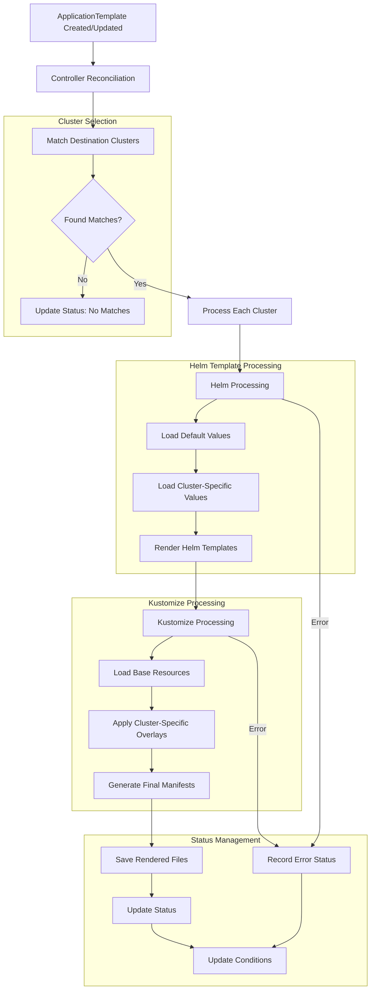

# Application Template

ApplicationTemplate is a custom resource for managing multi-cluster application deployments. It combines Helm charts with Kustomize to provide flexible application configuration management.

## How It Works

1. **Template Rendering Process**
   - First renders base manifests using Helm
   - Then customizes the rendered output using Kustomize
   - Finally generates complete deployment configurations for different target clusters

2. **Controller Responsibilities**
   - Validates template configurations
   - Executes rendering process and collects results
   - Provides preview and validation of rendered results
   - Tracks rendering status and matched target clusters


## workflow



## spec

```yaml
apiVersion: apptemp.github.com/v1alpha1
kind: ApplicationTemplate
metadata:
  name: sample-application-template
  namespace: application-templates
spec:
  name: app-chart                # required: name of the ApplicationTemplate
  repoURL: https://example.com/redis  # required: source repository URL

  helm:                         # required: Helm configuration
    chart: "my-app-chart"       # required: chart name
    version: "1.0.0"           # required: chart version
    repository: "oci://registry-1.docker.io/bitnamicharts/redis"  # optional: Helm repository URL
    defaultValuesPath: "helm/values.yaml"  # optional: default values file path
    renderTargets:             # targets for rendering with different values
      - valuesPath: "helm/values-sit.yaml"  # values file path relative to source repo
        destinationCluster:    # required: cluster selector for deployment
          matchLabels:
            environment: sit
            region: cn-hangzhou
      - valuesPath: "helm/values-uat.yaml"
        destinationCluster:
          matchLabels:
            environment: uat
            region: cn-beijing
      - valuesPath: "helm/values-sit0.yaml"
        destinationCluster:
          name: kubernetes.default.svc-3396314289  # direct reference to ArgoCD cluster
  kustomize:                   # optional: Kustomize configuration
    renderTargets:            # targets for Kustomize overlays
      - path: "overlays/sit"  # overlay directory path
        destinationCluster:
          matchLabels:
            environment: sit
            region: cn-hangzhou
      - path: "overlays/uat"
        destinationCluster:
          matchLabels:
            environment: uat
            region: cn-beijing

status:
  phase: Succeeded            # Overall status
  matchedClusters:           # List of matched destination clusters
    - name: "kubernetes.default.svc-3396314289"
      matchedBy: "name"      # Matched by direct name reference
      rendered: true
    - name: "cluster-47.242.186.46-1493148463"
      matchedBy: "labels"    # Matched by label selector
      matchedLabels:
        environment: sit
        region: cn-hangzhou
      rendered: true
    - name: "cluster-47.242.187.46-1493148464"
      matchedBy: "labels"
      matchedLabels:
        environment: uat
        region: cn-beijing
      rendered: true
  renderedFiles:             # List of rendered manifest files
    - path: "/tmp/redis-sit-cluster-kubernetes.default.svc-3396314289.yaml"
      cluster: "kubernetes.default.svc-3396314289"
      type: "helm+kustomize"  # Rendered with both Helm and Kustomize
      timestamp: "2024-11-08T16:56:16+08:00"
    - path: "/tmp/redis-uat-cluster-47.242.186.46-1493148463.yaml"
      cluster: "cluster-47.242.186.46-1493148463"
      type: "helm+kustomize"
      timestamp: "2024-11-08T16:56:17+08:00"
    - path: "/tmp/redis-kubernetes.default.svc-3396314289.yaml"
      cluster: "kubernetes.default.svc-3396314289"
      type: "helm"           # Rendered with Helm only
      timestamp: "2024-11-08T16:56:18+08:00"
  conditions:                # Status conditions
    - type: Ready
      status: "True"
      lastUpdateTime: "2024-11-08T16:56:18+08:00"
      reason: "RenderingSucceeded"
      message: "Successfully rendered manifests for all matched clusters"
    - type: ClusterMatching
      status: "True"
      lastUpdateTime: "2024-11-08T16:56:16+08:00"
      reason: "ClustersMatched"
      message: "Successfully matched 3 destination clusters"