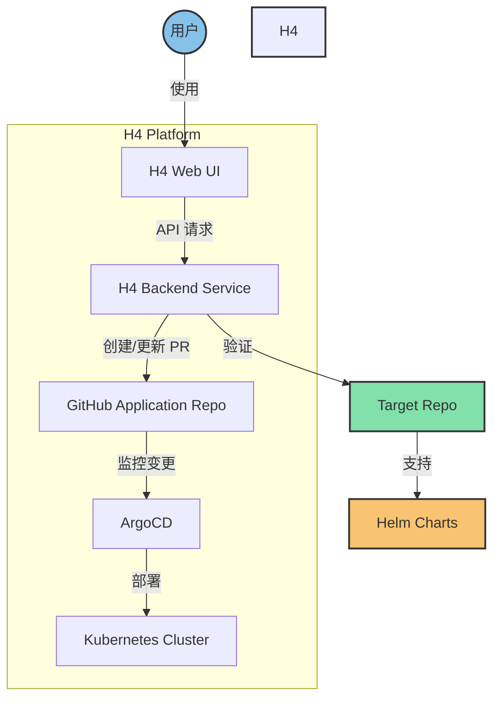

# Propose H4 Platform

H4 Platform 是一个基于 Kubernetes 的计算平台，支持多租户，多云，大数据组件集成。

## 优势

这个组件是基于 Kubernetes + ArgoCD （GitOps）+ H4 components 构建的，基于 Kubernetes 允许熟悉云原生的开发者 Kubernetes API 进行拓展开发。

1. 基于 Kubernetes，不要额外学习其他容器平台的概念
2. 基于 ArgoCD 部署更加容易
3. H4 components 自研组件更切合业务场景，支持审批，计费等

H4 Platform 架构图：

1. 组件
	1. H4 web ui： 目的是用户友好，提供必要的引导。
	2. H4 backend service 是核心组件， 核心功能以RESTFUL API的形式对外提供（validate repo，create application）：
		1. validate 接口验证用户的输入参数是否正确，检查 repo 和 overlay 是否符合 spec 标准。
		2. create application 根据用户输入的信息，渲染出一个 pull request 到 部署 repo
	3. Github application repo：核心仓库，所有需要部署到线上的结果都是描述在这个仓库中

2. 概念
	1. target repo：需要被部署到 h4 Platform 平台的repo，需要支持 helm 。

用户场景
1. 部署业务到 H4 Platform
	1. 打开 H4 web ui 填写必要的参数，点击验证 repo ， 验证通过之后点击 submit。
	2. H4 backend service收到来自前端的求，创建一个 pull request 到 application repo，
	3. 当 application repo 的 pull request 被merge 之后，argocd 发现 repo 添加新的application 自动完成部署

2. 业务更新
	1. 打开 H4 web ui 填写必要的参数，点击验证 repo ， 验证通过之后点击 submit。
	2. H4 backend service收到来自前端的请求，创建一个 pull request 到 application repo 完成指定的 application的更新
	3. 当 application repo 的 pull request 被merge 之后，argocd 发现 repo application 发生更新，自动完成部署。

3. 业务状态查询
	1. 点击 H4 web ui  会检查到 application 的状态，当前部署的 hashid

4. 业务的下线
	1. 打开 H4 web ui ，选择需要的application 点击删除
	2. H4 backend service收到来自前端的请求，创建一个 pull request 到 application repo 完成 application的删除
	3. 当 application repo 的 pull request 被merge 之后，argocd 发现 repo application 发生更新，自动完成部署。

5. 安全性和访问控制
   1. 集成身份认证系统（如 OAuth2、OIDC）
   2. 实现细粒度的 RBAC（基于角色的访问控制）
   3. 加密敏感数据（如 Kubernetes Secrets）
   4. 实现 API 网关，统一管理 API 访问和安全策略

6. 可观测性
   1. 集成日志收集系统（如 ELK Stack 或 Loki）
   2. 实现监控系统（如 Prometheus + Grafana）
   3. 集成分布式追踪系统（如 Jaeger 或 Zipkin）
   4. 实现告警系统，及时通知异常情况

7. 扩展性和灵活性
   1. 支持多种部署方式（Helm、Kustomize、原生 YAML）
   2. 提供插件系统，允许用户扩展平台功能
   3. 支持多集群管理，实现跨区域部署
   4. 实现服务网格集成（如 Istio），提供更强大的流量管理能力

8. 自动化和 CI/CD
   1. 集成 CI 系统（如 Jenkins 或 GitLab CI），自动化测试和构建
   2. 实现自动化回滚机制，快速响应部署异���
   3. 提供蓝绿部署和金丝雀发布等高级部署策略
   4. 实现自动化扩缩容策略

9. 用户体验优化
   1. 提供详细的文档和使用指南
   2. 实现应用程序模板库，方便用户快速部署常见应用
   3. 提供可视化的应用程序拓扑图和依赖关系图
   4. 实现自助服务门户，允许用户自主管理资源配额

10. 成本管理和资源优化
    1. 实现资源使用量统计和成本分析
    2. 提供资源优化建议，如检测闲置资源
    3. 实现自动化成本控制策略，如根据使用情况自动调整资源配额

用户场景（新增）：

5. 应用程序性能分析
   1. 用户通过 H4 Web UI 查看应用程序的性能指标和资源使用情况
   2. 系统自动生成性能报告，并提供优化建议
   3. 用户可以根据建议调整应用程序配置或资源分配

6. 多环境管理
   1. 用户可以在 H4 Web UI 中定义多个环境（如开发、测试、生产）
   2. 系统自动管理不同环境的配置和部署策略
   3. 用户可以轻松地在环境之间推送更新和回滚

7. 故障排查和自动修复
   1. 系统检测到应用程序异常时，自动触发故障排查流程
   2. H4 Backend Service 分析日志和监控数据，生成故障报告
   3. 对于已知问题，系统可以自动��行修复操作
   4. 用户可以通过 H4 Web UI 查看故障详情和修复进度

